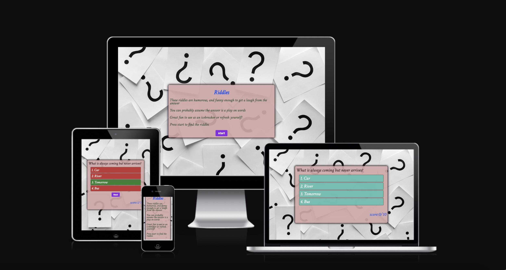
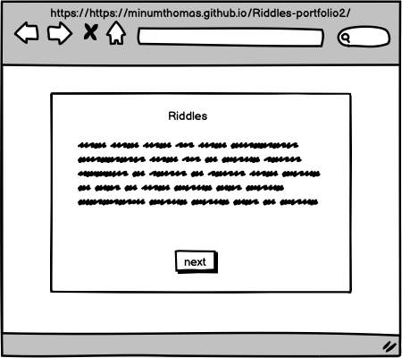
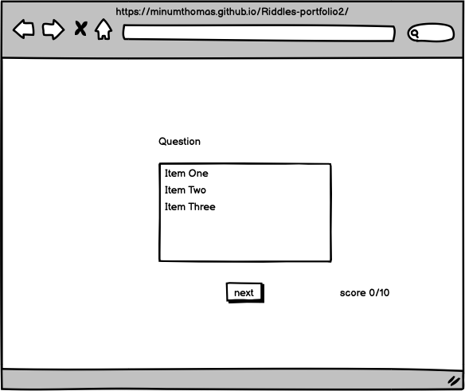
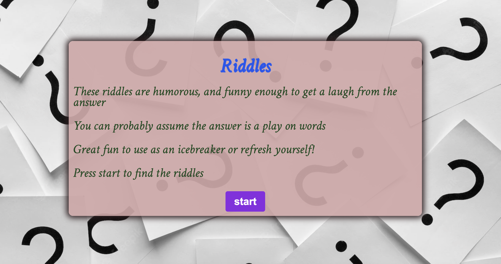
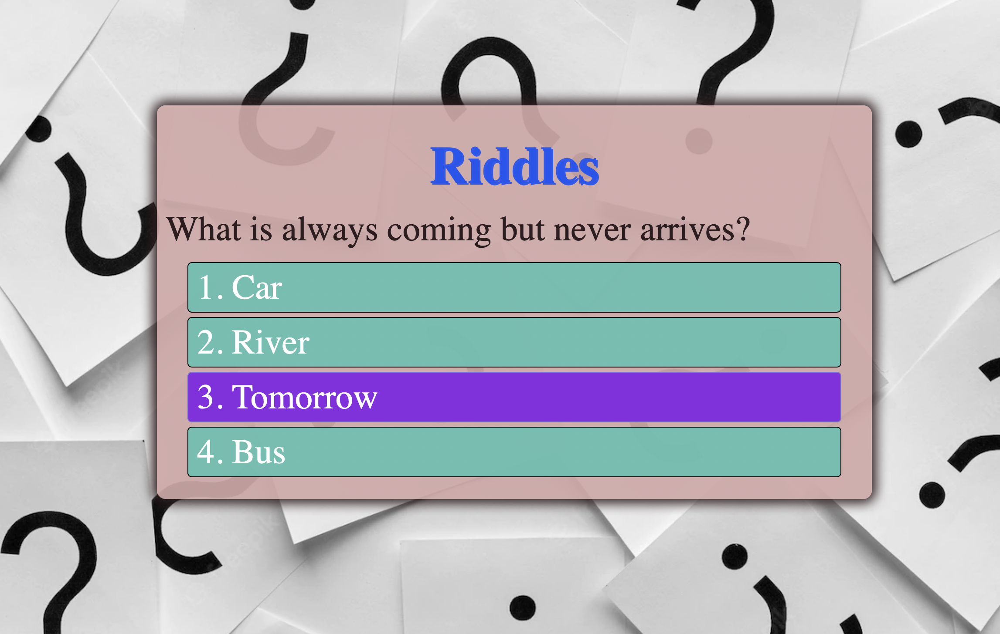
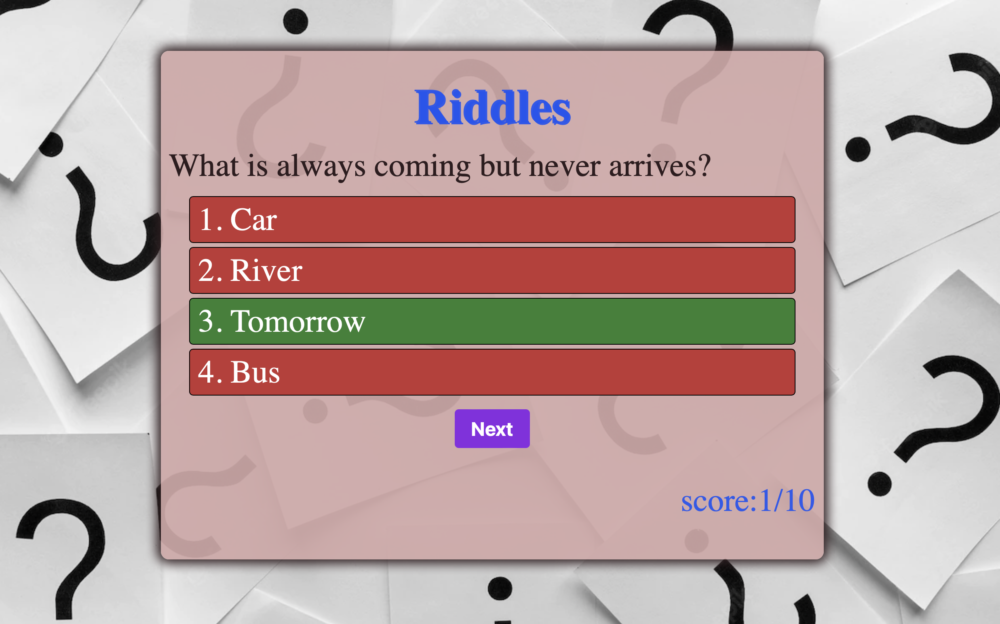
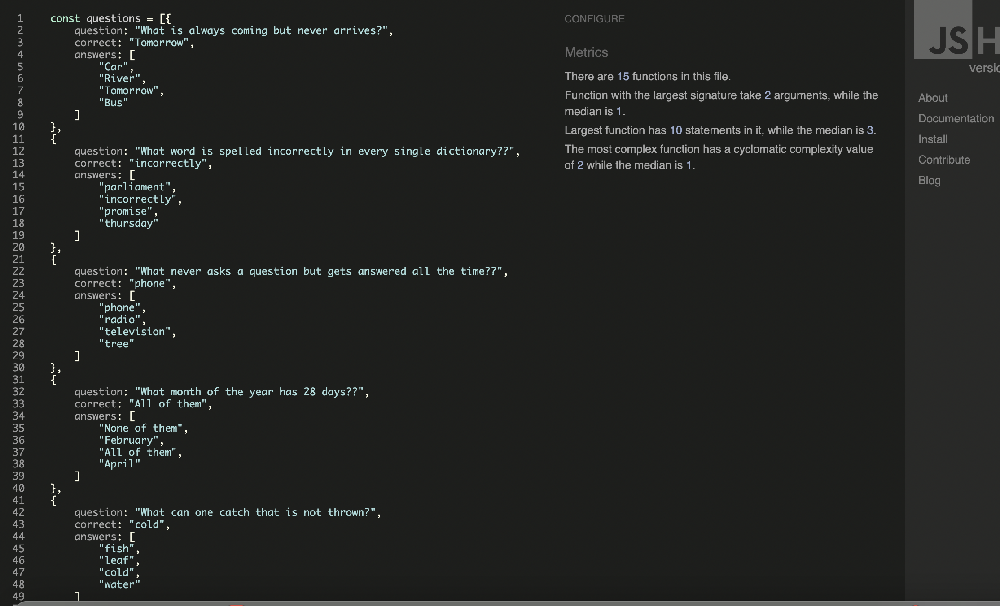
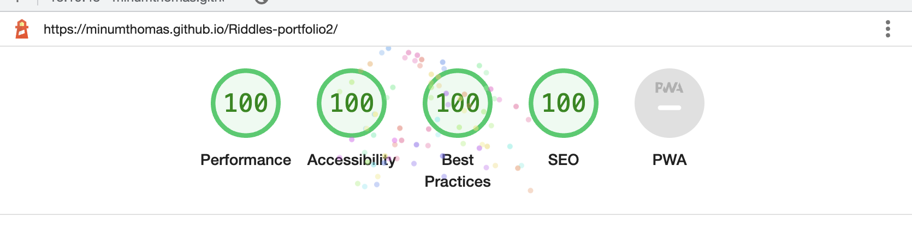

# Riddles
'Riddles' is an online riddle questions with amswer options and is made with java script. 

View live website here! <a href="https://minumthomas.github.io/Riddles-portfolio2/">link</a>

## UX

#### User Stories
First time users
- As a user of the site, I want to check how this page work
- As a user of the site, I want to see what kind of riddles

#### Site owner

- As an owner of the site, I want to provide some refreshment time for user 

 
#### Site structure

- The home page will have quiz logo and start button 
##### start button
- after cliking the start button the question and answers will show on the same page
##### next button 
- the next button will load next qustion
##### score
- score will update after answering each question

**Development**

This web page developed with riddle questions for fun. small riddle time will make the user relaxed from a stressful day

### Strategy
It's simple riddles for time pass .

## Scope

__Content__

Home page with start button and next page with queston and answer options. 

__Funtional Reqirements__

- buttons to start and move on next question.
- update scores

**Skeleton**
The skeleton wireframe was made to give a clean and easy to use experiance.
Made with Balsamiq

**Structure**
The information and features was made into a easy to follow and read structure, with clear directions.
Structure made with Balsamiq

- Wireframe 

### Typography

- All fonts are imported from google fonts – Crimson Text', serif;
 

### Color scheme

-  rgba(79, 193, 177, 0.893)
-  rgba(211, 167, 167, 0.92)
-  rgb(226, 191, 203)

## Features

- **Home Page**

- **page after click on start button**

- **page after clicking on answer option**

## Technologies Used

Main Language Used
- HTML5
- CSS3
- Java Script

## Validator Testing

- W3C HTML validation link:
 <a href="https://validator.w3.org/nu/?doc=https%3A%2F%2Fminumthomas.github.io%2FRiddles-portfolio2%2Findex.html">link</a>

-  W3C CSS validation link : 
<a href= "https://jigsaw.w3.org/css-validator/validator?uri=https%3A%2F%2Fminumthomas.github.io%2FRiddles-portfolio2%2Fassets%2Fcss%2Fmain.css&profile=css3svg&usermedium=all&warning=1&vextwarning=&lang=en">link</a>

- JS Hint.com used for Java Script code validation

- Light house

## Manual testing
- Tested 
- Tested on 
- Tested on 

## Deployment
- The project was created in Github using the Code Institute’s full template
- Github was used for code repository 

 
#### Project deployment steps below

- Open Github repository
- Click Settings
- Click Pages on the left-hand side
- In Source select main branch and root
- Click save
- Click the link to the live site

## Unfixed bugs
No unfixed bugs

## Credits and Reference

- W3School 
- stackoverflow
-  
- README.md of cookbook project
- coding-boot-camp- professional-readme-guide
- All images are free to use and taken from freepik.com
- riddles and introduction taken from brightful me blog

## Acknowledgements

- 
